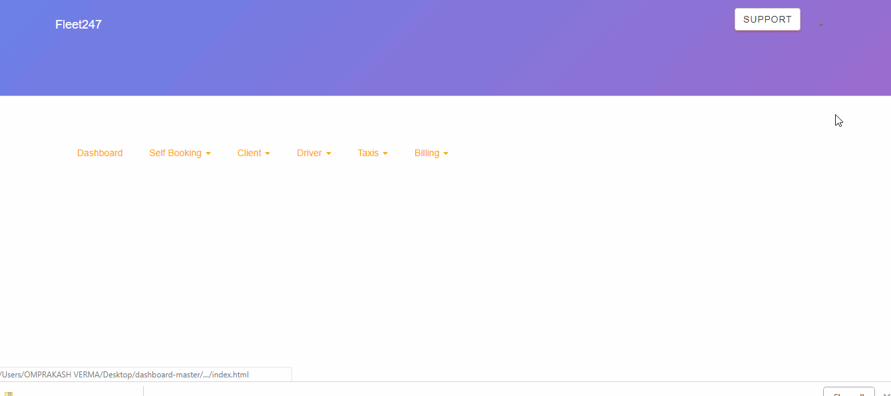

 Dated : 30 oct 2018
 ## Thoughts
 I am trying to find all the files used for the navigation bar in order to make the nav bar responsive.
 
 ## Problems that I am facing 
 
 * Even after merging all the related files that I think are used in making the header/navigation the look
 of the nav bar is not the same .
 
 * The profile option is visible in my file but not in fleet247. 
 
 * The color/styles of support button is not chnged even after linking the button.scss in index.html
 
 * I need to find a way of adding node modules/npm dependencies as gitignore files so that the node modules are not a potential security vulnerability
 
 
 
